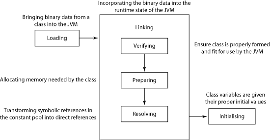

#  Agenda

- Eclipse - skróty klawiszowe
- Klasa -> Konstruktor -> Instancja obiektu
- pakiety
- enkapsulacja
- final
- static
- overloading

---
# Eclipse - skróty klawiszowe

| Skrót            | Co robi                                                      |
| ---------------- | ------------------------------------------------------------ |
| Ctrl + Space     | Sugeruje podpowiedzi                                         |
| CTRL + SHIFT + T | Wyszukuje klasy                                              |
| CTRL + SHIFT + R | Open Resource - pomaga w wyszukiwaniu określonego pliku w całym projekcie. |
| CTRL + 1         | Wywołuje sugestie naprawy kodu, gdy w danym elemencie jest błąd lub warning |
| CTRL + L         | Go to Line                                                   |
| Ctrl + O         | Wyświetla wszystkie części danej klasy                       |
| F5               | Odśwież                                                      |
| debug: F5        | Wej do środka                                                |
| debug: F6        | Idź do następnej linii                                       |
| sysout+Ctrl+Space| System.out.println();                                        |

---
# Podstawy dziedziczenia, interfejsy

1. w Javie można dziecziczyć tylko po jednej klasie
2. klasa może implementować wiele interfejsów
3. Jeżeli klasa implementuje interfejs musi mieć ciało medody z interfesu
4. Wszystkie klasy dziedziczą po java.lang.Object:
	hashCode(), equals(), toString()

---
## Class loader
Klasa -> Konstruktor -> Instancja obiektu
<br/><br/><br/>


---
# Pakiety 1/2
#### import klasy z innego pakietu
#### modyfikator dostępu public, private, protected, default

---
# Pakiety 2/2
#### konflikt nazw

```java
package com.cognitran.classes.topic3;

import com.cognitran.classes.topic3.animals.Cat2;

public class PackagesImporting {
    public static void main(String[] args) {
        Cat2 cat = new Cat2();
        cat.name = "Filemon";
        cat.play();

        com.cognitran.classes.topic3.caterpilar.Cat2 caterpilar = new com.cognitran.classes.topic3.caterpilar.Cat2();
        caterpilar.dig();
    }
}
```

---
# final 1/2
#### final jako zmienna (stała?)
```java
    public static void main(String[] args) {
        System.out.println("Obiekty");

        final Cat4 c = new Cat4("Bonifacy");
        c.setColor("niebieski");

        c.play();

//        c = new Cat4("Filemon");
        c.setColor("zielony");
        c.play();
    }
```

---
# final 2/2
#### final jako pole i jako argument
```java
public class Cat5 {
    private final String name;
    private String color;

    private void say(final String what) {
        System.out.println(name + "(kot): " + what);
    }

    public Cat5(final String name) { this.name = name; }

    public Cat5(final String name, final String color) {
        this.name = name;
        this.color = color;
    }

    public String getName() { return name; }

    public void setColor(final String color) { this.color = color; }

    public void play() {
        say("bawię się w kolorze " + color);
    }
}
```

---
# static 1/2
- pole static
- pole final static

```java
public class Cat6 {
    public static final int LEGS_COUNT = 4;
    public static String DEFAULT_COLOR = "biały";

    private String name;
    private String color;

    public Cat6(String name) {
        this.name = name;
        color = DEFAULT_COLOR;
    }
}
```

---
# static 2/2
#### używanie pól static z zewnątrz

```java
public class CatsAndStatics {
    public static void main(String[] args) {
        Cat6 c1 = new Cat6("Bonifacy");
        c1.play();

        System.out.println(c1.LEGS_COUNT);
        System.out.println(Cat6.LEGS_COUNT);

        System.out.println(c1.defaultColor);
        System.out.println(Cat6.defaultColor);

        c1.defaultColor = "czarny";

        Cat6 c2 = new Cat6("Bonifacy");
        c2.play();
    }
}
```

---
# przeciążanie metod / overloading

Sygnatura metody - składa się z typu zwracanego przez metodę, nazwy metody, listy typów i nazw parametrów metody

Sygnatura metody w obrębie klasy w której jest definiowana musi być unikatowa, nie można zdefiniować dwóch metod o identycznej sygnaturze.


```java
public void play() {
    say("bawię się w kolorze " + color);
}

public void play(String how) {
    say("bawię się w kolorze " + color + " w " + how);
}
```
---