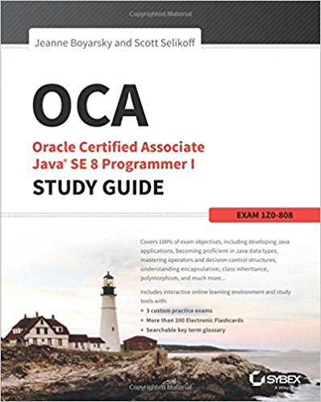

#  Agenda
- Modyfikatory dostępu
- Enkapsulacja
- Dziedziczenie

---
## Modyfikatory dostępu (ang. access modifiers)
* public
* protected
* default
* private

```java
public class Cat {

    private String privateName;
    protected String name;
    public String publicName;

    void play() {
        System.out.println("Jestem kotek " + name + " i się bawię.");
    }
}
```

---
#Immutable Objects

Immutable object jest to niezmienny obiekt, czyli taki, którego stan nie może zostać zmieniony cały okres życia obiektu. Czyli po prostu tworzymy nasz obiekt wraz ze wszystkimi wymaganymi atrybutami i żadnego z nich nie możemy zmienić.

Przykład: **java.lang.String** - nie ma żadnej metody typu set***()

* Są łatwiejsze w użyciu i testowaniu
* Można je bezpiecznie używać w Setach lub jako klucz w Mapach
* Mogą być łatwo cachowane
* Immutable object mogą być bezpiecznie używane w programowaniu wielowątkowym. Stan tych obiektów nie może ulec zmianie, więc mamy pewność, że każdy wątek widzi aktualny stan obiektu.

---
# Enkapsulacja 1/2
* polega na ukrywaniu pewnych danych składowych lub metod obiektów danej klasy tak, aby były one dostępne tylko metodom wewnętrznym danej klasy

```java
public static void main(String[] args) {
	Cat2 cat = new Cat2();
	cat.name = "Alik"; // dozwolone, ale złe
	cat.setName("Alik"); //lepsze
}
```

```java
public class Cat3 {
    private String name;
    private String color;

	public void setName(String name) { this.name = name; }
    public String getName() { return name; }
    public void setColor(String color) { this.color = color; }
	public String getColor() { return color; }
}
```
**Ctrl + 1 -> create getter and setter for X** albo **Source -> generate getters and setters**

---
# Enkapsulacja 2/2
* używaj prywatnych atrybutów klasy (względnie protected)
* używaj publicznych metod aby pobrać lub ustawić wartość zmiennej danej klasy
* Dla tych metod używaj konwencji JavaBeans: setSomeProperty i getSomeProperty.

---

### Dziedziczenie i kompozycja - relacje Is-A, Has-A

Dziedziczenie oraz kompozycja służy zmniejszeniu ilości kodu.

```java
public class Animal { }

public class Horse extends Animal { //Is-A - Koń jest zwierzęciem

	private Halter myHalter; //Has-A - Koń ma uprząż
}
```

---
### Zadanie domowe

przeczytać pierwsze 2 rozdziały OCA/OCP Java® SE 7 Programmer I & II Study Guide by Kathy Sierra:
1. Declarations and Access Control
2. Object Orientation



