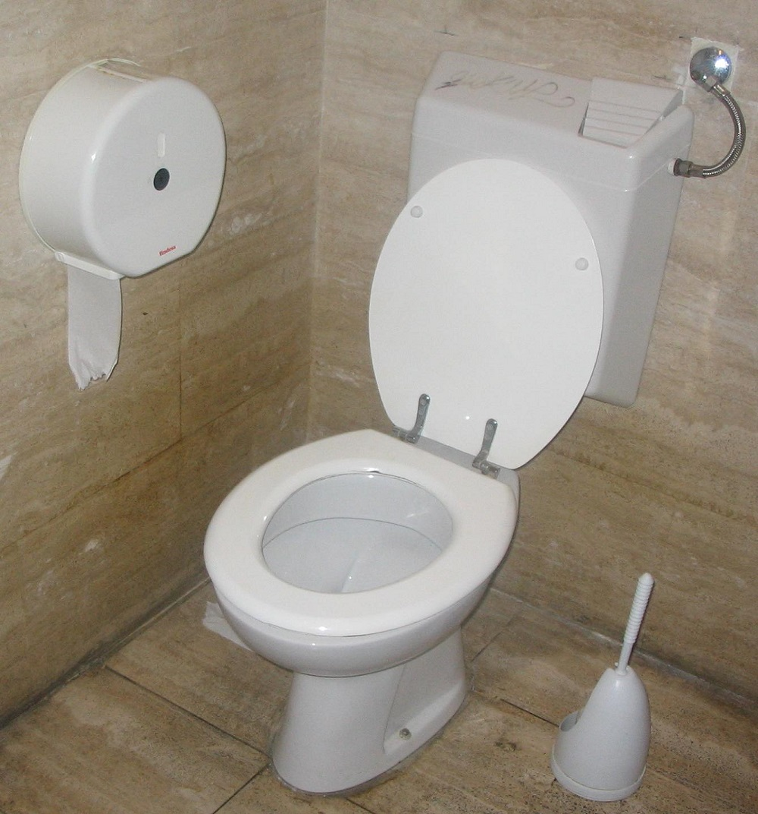

class: center, middle, inverse
# Operacje wejścia/wyjścia
### Czyli o strumieniach, pisarzach i czytelnikach <br>(oraz o tym, dlaczego nie sposób mówić po polsku o programowaniu...)

---

## Operacje wejścia/wyjścia
#### Strumienie - I/O streams

**Strumień** reprezentuje wejście lub wyjście, np:
- plik na dysku
- połączenie sieciowe
- tablica bajtów w pamięci


---

## Operacje wejścia/wyjścia
#### Strumienie - I/O streams

.pull-left[
- **InputStream**
	- strumień wejściowy
	- można z niego odczytać dane


]

.pull-right[
- **OutputStream**
	- strumień wyjściowy
	- można do niego zapisać dane


]

---


## Operacje wejścia/wyjścia
#### Strumienie bajtowe - odczyt pliku

- Odczyt bajt po bajcie
- Pułapka: typ int, ale wartości jednego bajtu, 0-255

```java
InputStream inStream = new FileInputStream("file.dat");

int b = inStream.read();
while(b > 0) {
	// zrób coś z b
	
	b = inStream.read();
}
```

&nbsp;

```java
InputStream inStream = new FileInputStream("file.dat");

int b;
while((b = inStream.read()) > 0) {
	// zrób coś z b
}
```

---


## Operacje wejścia/wyjścia
#### Strumienie bajtowe - odczyt pliku

- Odczyt do bufora

```java
InputStream inStream = new FileInputStream("file.dat");

byte[] byteArray = new byte[1024];
int bytesRead = inStream.read(byteArray);
```

&nbsp;

```java
InputStream inStream = new FileInputStream("file.dat");

byte[] byteArray = new byte[1024];
int bytesRead;

while((bytesRead = inStream.read(byteArray)) > 0) {
	// zrób coś z bytesArray
}
```

---


## Operacje wejścia/wyjścia
#### Strumienie bajtowe - zapis do pliku

- Zapis bajt po bajcie
- Zapis bajtów z bufora

```java
OutputStream outStream = new FileOutputStream("file.out");

int b = 17;
outStream.write(b);

byte[] byteArray = { 3, 5, 7, 12, -1 };
outStream.write(byteArray);
```

---


## Operacje wejścia/wyjścia
#### Strumienie znakowe - odczyt pliku

- Odczyt znaków Unicode - do `int` lub `char[]`

```java
FileReader reader = new FileReader("lorem.txt");

int character = reader.read();

char[] cbuf = new char[1024];
int noOfChars = reader.read(cbuf);
```

&nbsp;

```java
FileReader reader = new FileReader("lorem.txt");

int character;
while((character=reader.read())>0) {
	System.out.printf("%c", character);
}
```

---


## Operacje wejścia/wyjścia
#### Strumienie znakowe - zapis do pliku

- Zapis pojedynczych znaków lub łańcuchów

```java
FileWriter writer = new FileWriter("file.txt");

int characterCode = 65;
writer.write(characterCode);

char character = 'B';
writer.write(character);

String text = "Ala ma kaca";
writer.write(text);
```

---


## Operacje wejścia/wyjścia
#### Strumienie znakowe buforowane - operacje na liniach tekstu

- BufferedReader i BufferedWriter

Operacje na strumieniu stają się buforowane. W większości przypadków skutkuje to znaczącym wzrostem efektywności. Zamiast wykonywać wiele drobnych operacji na strumieniu, np. wiele razy odczytywać/zapisywać z pliku dyskowego małe porcje danych. Dekorator odczytuje większą porcję na zapas lub zapamiętuje dane, które mają być wysłane do strumienia dopóki nie uzbiera się ich dostateczna ilość. Jeżeli dane powinny być wysłane do strumienia niezwłocznie, niezależnie od tego, czy bufor jest pełen czy nie, można to wymusić wywołując metodę flush(). Bufor jest opróżniany również w momencie wywołania metody close().
---


## Operacje wejścia/wyjścia
#### Strumienie znakowe buforowane - operacje na liniach tekstu

- Odczyt linia po linii: `BufferedReader`

```java
BufferedReader bufReader = new BufferedReader(new FileReader("lorem.txt"));

String line = bufReader.readLine();

while(line!=null) {
	line = bufReader.readLine();
}
```

- Zapis linia po linii: `BufferedWriter`

```java
BufferedWriter writer = new BufferedWriter(new FileWriter("file.txt"));

writer.write(65);
writer.newLine();

writer.write('B');
writer.newLine();

writer.write("Ala ma kaca");
writer.newLine();
```

---

## Obsługa wyjątków I/O
#### Zamykanie otwartych zasobów

Obsługa wyjątków przy operacjach wejścia/wyjścia
- łapanie wyjątku
- zamykanie strumienia/readera

```java
try {
	FileReader in = new FileReader("produkty.txt");
	
	// odczytaj dane z pliku....
	
	in.close();
	
} catch(IOException e) {
	e.printStackTrace();
}
```

.zle[ŹLE!!!]

---

## Obsługa wyjątków I/O
#### Zamykanie otwartych zasobów

Zamykanie "po staremu" (przed Javą 7)

```java
try {
	FileReader in = new FileReader("produkty.txt");
	
	// odczytaj dane z pliku....

} catch(IOException e) {
	e.printStackTrace();
} finally {
	in.close();
}
```

.zle[ŹLE!!!]

---

## Obsługa wyjątków I/O
#### Zamykanie otwartych zasobów

Zamykanie "po staremu" (przed Javą 7)

```java
FileReader in = null;

try {
	in = new FileReader("produkty.txt")
	
	// odczytaj dane z pliku....
	
} catch(IOException e) {
	e.printStackTrace();
} finally {
	if(in != null) {
		try {
			in.close();
		} catch(IOException ex) { // ignored
		}
	}
}
```

.dobrze[DOBRZE]

---

## Obsługa wyjątków I/O
#### Zamykanie otwartych zasobów

Konstrukcja *try with resources*

```java
try(  FileReader in = new FileReader("produkty.txt")  ) {
	
	// odczytaj dane z pliku....
	
} catch(IOException e) {
	e.printStackTrace();
}
```

.dobrze[DOBRZE]

---

## Operacje I/O
#### Wzorzec projektowy Dekorator


---

## Operacje I/O
#### Dekorator i strumienie

Opakowanie `FileReader` w buforowany `BufferedReader`

```java
BufferedReader bufReader = new BufferedReader(new FileReader("lorem.txt"));

String line = bufReader.readLine();
while(line!=null) {
	...
	
	line = bufReader.readLine();
}
```

---

## Operacje I/O
#### Dekorator i strumienie

Opakowanie strumienia w `Reader`

```java
public void someMethod(InputStream inStream) throws IOException {
	BufferedReader reader = new BufferedReader(new InputStreamReader(inStream));
	
	reader.readLine();
	
	...
}
```

---

## Operacje I/O
#### Dekorator i strumienie

Łańcuch operacji: kompresja, szyfrowanie, zapis do pliku

```java
// plik wejściowy
InputStream inStream = new FileInputStream("lorem.txt");

// przygotowanie szyfratora
SecretKeySpec keySpec = new SecretKeySpec("secretkey0123456".getBytes(), "AES");
Cipher cipher = Cipher.getInstance("AES");
cipher.init(Cipher.ENCRYPT_MODE, keySpec);

// szyfrowany i kompresowany strumień wyjściowy
OutputStream outStream = new GZIPOutputStream(
	new CipherOutputStream(
		new FileOutputStream("lorem.enc"), cipher
	)
);

// przepisanie input do output
int b;
while( (b = inStream.read()) > 0 ) {
	outStream.write(b);
}
```

---

## Operacje I/O
#### Dekorator i strumienie

Łańcuch operacji: odczyt z pliku, deszyfrowanie, dekompresja

```java
SecretKeySpec keySpec = new SecretKeySpec("secretkey0123456".getBytes(), "AES");
Cipher cipher = Cipher.getInstance("AES");
cipher.init(Cipher.DECRYPT_MODE, keySpec);

InputStream inStream = new GZIPInputStream(
	new CipherInputStream(new FileInputStream("lorem.enc"), cipher));

BufferedReader inReader = new BufferedReader(new InputStreamReader(inStream));

String line;
while((line = inReader.readLine())!=null) {
	System.out.println(line);
}
```